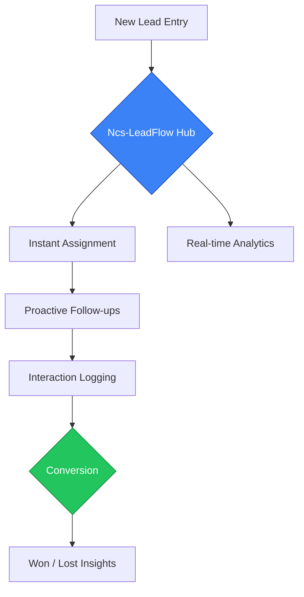
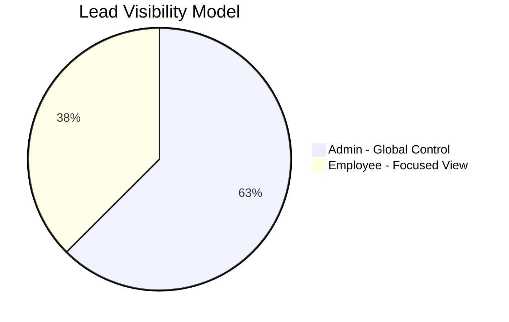

# 🚀 Ncs-LeadFlow CRM
### *Enterprise Lead Orchestration & Sales Intelligence Platform*

**Developed for Nucleosys Tech**  
*Powering the next generation of digital sales transformation*

---

## 🧐 Project Overview

In high-velocity sales environments, **Lead Leakage** is the silent killer of growth.  
Leads often disappear into spreadsheets, inboxes, or fragmented communication channels.

**Ncs-LeadFlow** was engineered to eliminate this chaos.

It acts as a **centralized sales intelligence hub**, tracking the complete lifecycle of a prospect — from first inquiry to successful conversion — with **real-time synchronization**, **activity intelligence**, and **zero operational friction**.

---

## 🔄 The LeadFlow Journey

## 🌟 Core Functionalities

### 📋 Intelligent Lead Management
A high-performance management hub offering dynamic table views with advanced multi-parameter filtering.  
The **Inline-Edit System** enables instant updates directly from the main view, reducing administrative overhead by up to **90%**.

---

### ⏳ Proactive Follow-Up System
LeadFlow functions as a digital sales assistant.  
It continuously analyzes next follow-up dates and highlights leads as **Overdue**, **Due Today**, or **Upcoming**, ensuring no opportunity is ever missed.

---

### 📞 Interaction & Call Intelligence
Every conversation matters.  
The **Call History module** maintains a chronological paper trail of discussions, pain points, and next steps — ensuring full context even during lead reassignment.

---

### 📊 Data-Driven Dashboard
A 30,000-foot view of sales performance:

- Conversion rates  
- 30-day lead generation trends  
- Team workload distribution  

This empowers leadership to make decisions backed by data — not intuition.

---

## 🔐 Governance & User Roles

LeadFlow uses a **Role-Based Access Control (RBAC)** architecture to ensure security, clarity, and operational focus.

| Role | Access Scope | Responsibilities |
|----|----|----|
| 👑 **Administrator** | Global | User management, lead reassignment, performance analytics, credential control |
| 👤 **Employee** | Assigned Leads Only | Personal pipeline management, follow-ups, interaction logging |

## 🛠️ Technical Philosophy

### 1️⃣ Consistency
Built with a standardized design system (**Shadcn UI**) to deliver a predictable, professional, and intuitive user experience across all modules.

### 2️⃣ Reliability
Powered by **PostgreSQL (Supabase)** with **Row Level Security (RLS)** and real-time data synchronization across all active sessions, ensuring data integrity and trust.

### 3️⃣ Efficiency
Advanced server-state management provides a **desktop-like experience** — instant updates, minimal loading times, and zero perceived lag.

---

## 🗺️ Roadmap & Future Vision

- **Omnichannel Integration**  
  Native WhatsApp and Email communication directly from lead profiles

- **Automated Reminders**  
  Smart, system-generated follow-up notifications for high-priority leads

- **AI Insights**  
  Predictive lead scoring based on interaction history and conversion probability

---

## 📄 Support & Credits

**Ncs-LeadFlow** is a proprietary CRM solution built exclusively for **Nucleosys Tech**.

Developed with ❤️ by **Yash Bhilare**  
*Lead Architect & Software Engineer*

<a href="#top">⬆️ Back to Top</a>

